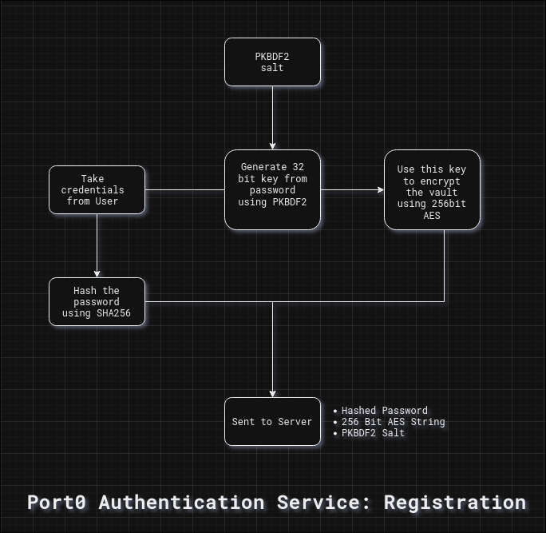

---
---


This section is for developers and administrators of Port0 itself and documents interals. If you are a developer who wants to integrate your applications with Port0, please refer to the [developer documentation]().


## To initiate account creation, collect a valid IIITK email address from the user and send the following request to the server:


This endpoint has strict rate limits.


```
POST JSON /auth/register
{
    "email": "<...>@iiitkottayam.ac.in"
}
```

## The server will send a verification OTP to the email address. Collect the OTP from the user and send the following request to the server:


This endpoint has strict rate limits.


```
POST JSON /auth/verify
{
    "email": "<...>@iiitkottayam.ac.in",
    "otp": "<OTP>"
}

Response:
{
    "token": "<JWT>"
}
```

## Proceed to create a new account with the JWT token in the Authorization header:

For the key hash use the following algorithm:

1. Use salted PBKDF2 hashing with 1000 iterations to generate a 32 bit key from the password.

2. Store the the key as the encryption key locally.

3. Hash the password again using SHA-256 and use it as the password hash for verification.

4. Now, encrypt the information into a 256 bit AES string using the 32 bit PKBDF2 key generated earlier and store it as the vault.

5. Send the auth JWT, the salt, the SHA-256 hashed password and the 256 bit AES encrypted vault to the server.




This endpoint has strict rate limits.


```
POST JSON /auth/create
{
    "token": "<JWT>",
    "salt": "<PBKDF2 salt>",
    "keyHash": "<key hash>",
    "aes256Bit": "<aes256Bit String>",
}
```
